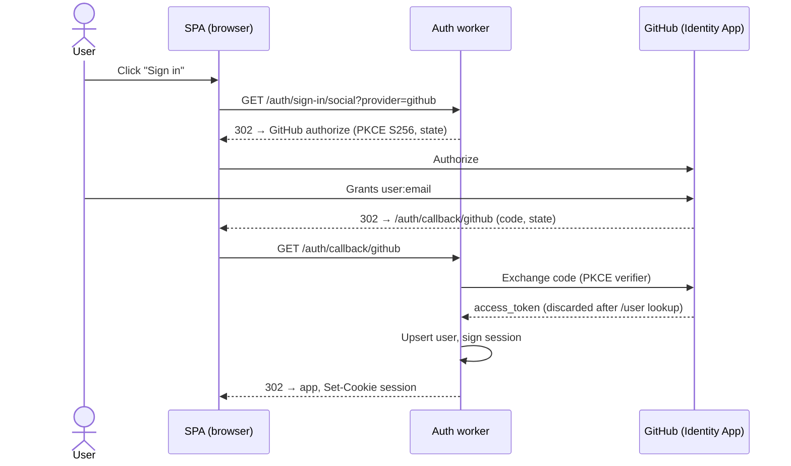
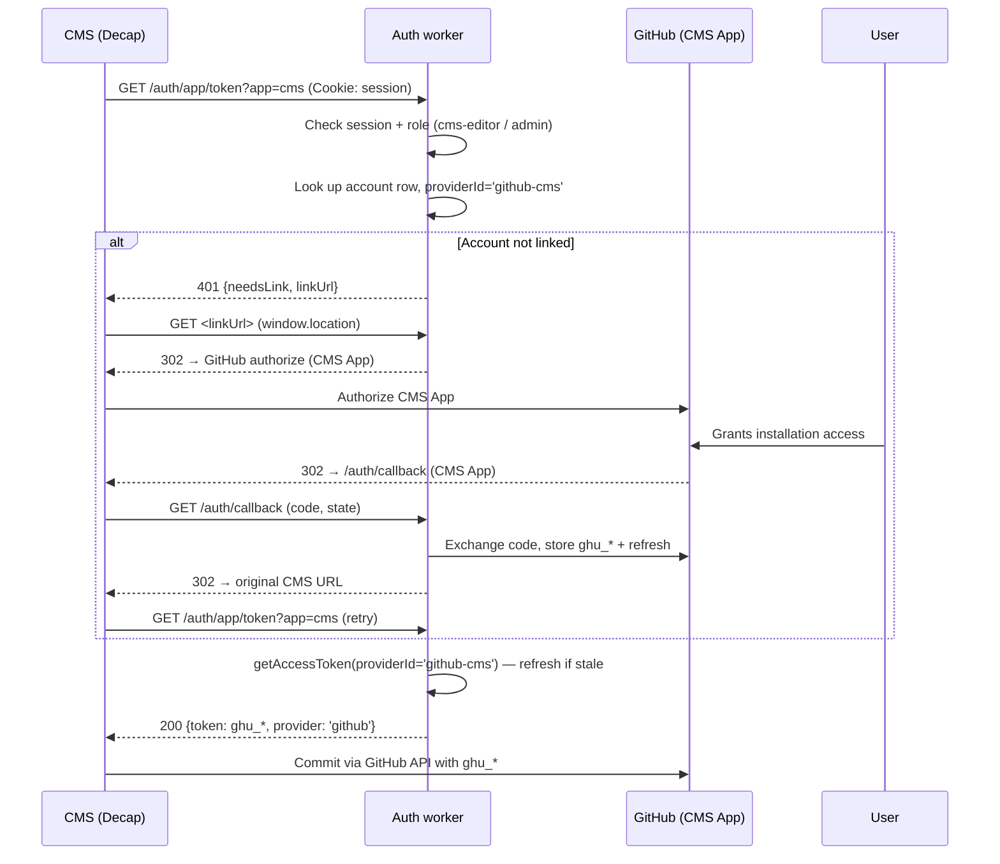
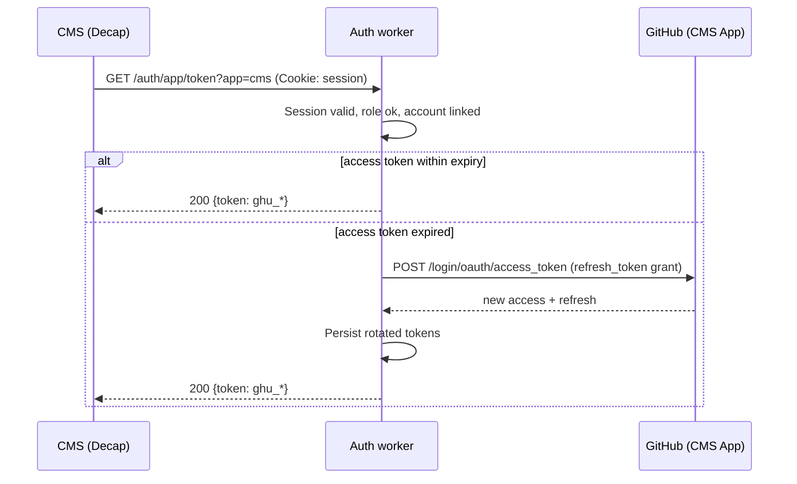

# auth

Cloudflare Worker providing identity and capability brokering for personal apps on `alexwilson.tech`. Built on [better-auth](https://better-auth.com) with Cloudflare D1 as the session store.

## Architecture

Two layers, deliberately separated:

```
 ┌────────────────────────────────────────────────────────────────────────┐
 │  Identity layer                                                        │
 │  One GitHub App ("identity App") with scope: user:email                │
 │  → produces a better-auth session cookie scoped to alexwilson.tech     │
 │  → consumed by every SPA on the domain via /auth/get-session           │
 │  → does NOT grant access to any repository                             │
 └────────────────────────────────────────────────────────────────────────┘
                                    │
                                    ▼
 ┌────────────────────────────────────────────────────────────────────────┐
 │  Capability layer (per-app, optional, opt-in)                          │
 │  Each app that needs GitHub access registers a separate GitHub App     │
 │  installed only on the repos it needs.                                 │
 │  Users opt in once per capability via a lazy "link account" flow.      │
 │  The auth worker stores per-provider tokens; capability endpoints      │
 │  return fresh tokens to the calling SPA.                               │
 │                                                                        │
 │    /auth/app/token?app=cms     → ghu_* from "CMS App"                  │
 │    /auth/app/token?app=photo   → ghu_* from "Photo App"  (future)      │
 │    (single endpoint; app identity via ?app= query param)               │
 └────────────────────────────────────────────────────────────────────────┘
```

**Sign-in never grants capability.** A user who has signed in (identity App) has no GitHub credential that touches repositories. The CMS App is linked lazily — only on the first call to `/auth/app/token?app=cms`. Other apps on the domain can identify the same user via `/auth/get-session` without ever triggering a capability link.

The capability endpoint is **generic**: one URL (`/auth/app/token`) serves every app, identified by the `?app=` query parameter. Each app is implemented as a class under `src/apps/` that satisfies the `AppPlugin` interface (`src/apps/types.ts`) and is registered in `src/apps/registry.ts`. Adding a new app does not add a new endpoint.

## Flows

### Sign-in (any SPA)



### CMS capability — lazy link on first access



### CMS capability — subsequent calls (warm)



Refresh tokens last 6 months; access tokens 8 hours. The user reconnects (clicks "Authorize" again) only when the refresh token expires.

## Adding another app

Pattern: an SPA that needs a GitHub credential of its own (rare — most apps only need identity).

1. Register a new GitHub App on GitHub. Install it only on the repos it needs. Generate `client_id` + `client_secret`.
2. Declare the secrets in `Env` (`src/env.ts`) and supply them via `wrangler secret put` / `.dev.vars` (e.g. `GITHUB_PHOTO_CLIENT_ID`, `GITHUB_PHOTO_CLIENT_SECRET`).
3. Write a new class under `src/apps/` that implements `AppPlugin` (`src/apps/types.ts`). Mirror the shape of `src/apps/cms.ts`: declare `id`, `providerId`, `requiredRoles`, return your `oauthConfig`, and add lifecycle hooks like `onSignOut` that revoke at the upstream API.
4. Add an instance of your class to the `APPS` array in `src/apps/registry.ts`.

No new endpoint, no router change. `auth.ts` derives the `genericOAuth` provider list from the registry; `app-token.ts` dispatches by `?app=` against the same registry; sign-out invokes `onSignOut` on every app. The consumer SPA calls `/auth/app/token?app=<your-id>`; existing apps are unaffected.

For SPAs that only need identity (probably most), no auth changes are needed beyond adding the SPA's origin to `TRUSTED_ORIGINS`.

For SPAs that only need identity (probably most), no auth-cms changes are needed beyond adding the SPA's origin to `TRUSTED_ORIGINS`.

## Routes

Better-auth owns `/auth/*` and exposes the standard endpoints. Custom additions:

| Route | Method | Purpose |
|---|---|---|
| `/auth/app/token?app=<id>` | GET | Returns a `ghu_*` token for the requested capability app. App id and role-gate driven by `src/apps/registry.ts`. 401 with `{ needsLink, provider }` if the user is signed in but hasn't linked that app's GitHub App yet (client drives the link flow via `POST /auth/oauth2/link`). |
| `/auth/manage` | GET, POST | Server-rendered admin UI. Role-gated to `admin`. Manages users, roles, bans, CMS-link revocation. |
| `/auth/*` | various | Owned by better-auth — sign-in, callback, session, admin plugin endpoints, etc. See [better-auth docs](https://better-auth.com/docs). |

## Standards

| Standard | Role |
|---|---|
| [RFC 6749](https://datatracker.ietf.org/doc/html/rfc6749) — OAuth 2.0 | Authorization Code grant for identity and capability flows; Refresh Token grant for silent renewal |
| [RFC 7636](https://datatracker.ietf.org/doc/html/rfc7636) — PKCE | S256 code challenge on every OAuth round-trip (handled by better-auth) |
| [RFC 9700](https://datatracker.ietf.org/doc/html/rfc9700) — OAuth 2.0 Security BCP | PKCE mandatory, state CSRF binding, exact redirect URI matching |
| [RFC 6265](https://datatracker.ietf.org/doc/html/rfc6265) — HTTP Cookies | Session cookie attributes: `HttpOnly`, `Secure`, `SameSite=Lax`, domain-scoped to `alexwilson.tech` |
| [RFC 6750](https://datatracker.ietf.org/doc/html/rfc6750) — Bearer Token Usage | `ghu_*` token presented to GitHub API as `Authorization: Bearer <token>` |
| [RFC 7591](https://datatracker.ietf.org/doc/html/rfc7591) — Dynamic Client Registration (shape only) | Per-app `genericOAuth` registrations follow the providerId / clientId / clientSecret / endpoints schema; registrations are static in code, not dynamic |

## Environment

### Bindings (wrangler.toml)

| Binding | Type | Purpose |
|---|---|---|
| `AUTH_DB` | D1 | better-auth tables: `user`, `session`, `account`, `verification` |

### Variables (wrangler.toml `[vars]`)

| Variable | Purpose |
|---|---|
| `BASE_URL` | Origin where the worker is reachable (e.g. `https://alexwilson.tech`) |
| `COOKIE_DOMAIN` | Domain for the session cookie (e.g. `alexwilson.tech`) |
| `TRUSTED_ORIGINS` | Comma-separated origins permitted to call `/auth/*` (CSRF + CORS) |

### Secrets (`wrangler secret put` / `.dev.vars`)

| Secret | Purpose |
|---|---|
| `BETTER_AUTH_SECRET` | Signs session and CSRF state. `openssl rand -base64 32`. |
| `GITHUB_CLIENT_ID` | Identity App client id |
| `GITHUB_CLIENT_SECRET` | Identity App client secret |
| `GITHUB_CMS_CLIENT_ID` | CMS App client id |
| `GITHUB_CMS_CLIENT_SECRET` | CMS App client secret |

### Local wrangler config

`.env` (gitignored) supplies `D1_DATABASE_ID` for wrangler's `$VAR` interpolation in `wrangler.toml`. Copy `.env.dist` to start.

## Setup

```bash
# 1. Install
pnpm install

# 2. Create D1, paste id into .env
wrangler d1 create auth-db
cp .env.dist .env  # paste the printed id

# 3. Apply migrations from ./migrations/ — both locally and remote.
pnpm db:migrate:local
pnpm db:migrate:remote

# 4. Secrets
openssl rand -base64 32 | wrangler secret put BETTER_AUTH_SECRET
wrangler secret put GITHUB_CLIENT_ID
wrangler secret put GITHUB_CLIENT_SECRET
wrangler secret put GITHUB_CMS_CLIENT_ID
wrangler secret put GITHUB_CMS_CLIENT_SECRET

# 5. Local secrets (for `wrangler dev`)
cp .dev.vars.dist .dev.vars  # fill in the same values

# 6. Run
pnpm dev
```

### GitHub App configuration

Both Apps share the same callback shape:

| Setting | Identity App | CMS App |
|---|---|---|
| Callback URL | `https://alexwilson.tech/auth/callback/github` (+ localhost for dev) | `https://alexwilson.tech/auth/oauth2/callback/github-cms` (+ localhost for dev) |
| Expire user authorization tokens | On | On |
| Webhook | Off | Off |
| User permissions | Email addresses: Read | Email addresses: Read |
| Installation permissions | (none) | Contents: R/W; Metadata: R; Pull requests: R/W |
| Install on | (irrelevant — never installed) | `alexwilson/content` only |

## Migrations

Schema is defined in `src/schema.ts` (Drizzle ORM TypeScript). Migrations are **generated automatically** by `drizzle-kit` from schema diffs and **applied** by `wrangler d1 migrations apply`.

```
src/schema.ts                       ← source of truth for tables
drizzle.config.ts                   ← drizzle-kit config (generation only)
migrations/000N_*.sql               ← generated SQL, committed
migrations/meta/_journal.json       ← drizzle-kit's tracking, committed
migrations/meta/000N_snapshot.json  ← state snapshots for future diffs, committed
```

### Day-to-day

```bash
pnpm db:migrate:local      # apply pending migrations to the local SQLite
pnpm db:migrate:remote     # apply pending migrations to remote D1
pnpm db:migrate:list       # show which migrations have been applied remotely
```

### Adding a new migration

When you change `src/schema.ts` (add a column, rename a table, etc.):

```bash
pnpm db:generate
# → drizzle-kit diffs your TS schema against the last snapshot and writes
#   migrations/000N_<random_name>.sql containing only the DDL for the diff.
#   It also updates meta/_journal.json and writes a new snapshot file.

pnpm db:migrate:local      # try locally first
pnpm db:migrate:remote     # then apply to production
```

No hand-authoring SQL. The generated `.sql` is plain SQLite DDL — read it before applying to production, especially for destructive operations (DROP COLUMN, type changes).

### Forward-only

Both drizzle-kit and `wrangler d1 migrations apply` are forward-only — no `down`. Fix forward when needed: change the schema again and generate another migration that reverses the previous change.

### Better-auth's schema

The `user`, `session`, `account`, `verification` tables in `src/schema.ts` match what better-auth's runtime expects (column names, types). Better-auth's `drizzleAdapter` is configured with `camelCase: true` to map TypeScript field names to camelCase DB columns. When updating better-auth or adding plugins:

1. Check if the plugin requires new columns. Better-auth's docs list these per-plugin (e.g. the `admin` plugin adds `role`, `banned`, `banReason`, `banExpires` to `user` and `impersonatedBy` to `session`).
2. Add the columns to `src/schema.ts`.
3. `pnpm db:generate && pnpm db:migrate:remote`.

## Operations

### Email allowlist

Sign-up is gated on the `allowedEmail` table. The `user.create.before` hook in `auth.ts` rejects any new account whose email isn't on the list. **Existing user rows are unaffected** — the gate is on creation only, so the first admin can be set up before the allowlist exists.

```bash
# Add the first allowed email so a second user can ever sign up:
wrangler d1 execute auth-db --remote \
  --command "INSERT INTO allowedEmail (email, createdAt) VALUES ('editor@example.com', datetime('now'))"
```

After that, the admin UI at `/auth/manage` has an "Allowed emails" section for add/revoke. Revoking an email does not delete an existing user row — it only blocks *future* re-sign-ups. To fully evict an existing user, also delete them via the admin UI.

### Promote a user

```bash
wrangler d1 execute auth-db --remote \
  --command "UPDATE user SET role='admin' WHERE email='alex@alexwilson.tech'"
# or
wrangler d1 execute auth-db --remote \
  --command "UPDATE user SET role='cms-editor' WHERE email='editor@example.com'"
```

Day-to-day user/role/ban management goes through the server-rendered admin UI at `https://alexwilson.tech/auth/manage` (role: `admin`). Bootstrap the first admin via SQL as above; everything after is point-and-click.

### Rotate the CMS App credentials

1. Generate a new client secret on the CMS App's GitHub settings page.
2. `wrangler secret put GITHUB_CMS_CLIENT_SECRET` with the new value.
3. Existing user `ghu_*` tokens continue working until they expire; new sign-ins use the new secret.

The identity App and any future capability App rotate independently — no other app is affected.

### Revoke a user's CMS access

```bash
wrangler d1 execute auth-db --remote \
  --command "DELETE FROM account WHERE providerId='github-cms' AND userId=(SELECT id FROM user WHERE email='evicted@example.com')"
```

Their identity session is untouched; only the CMS link is removed. Next call to `/auth/app/token?app=cms` returns the lazy-link prompt.

## What this isn't

- **Not** an OAuth 2.0 authorization server for third-party clients. There's no client registration UI, no consent screen, no per-client scopes. Capability registrations are static, in code.
- **Not** a general-purpose IdP. Only `alexwilson.tech` apps consume it; sharing across domains would require cross-origin sessions and is intentionally not supported.
- **Not** a credential vault. GitHub tokens are stored only because better-auth's account model stores provider tokens by default; the worker hands them out to the calling SPA on request. There is no "give me the user's GitHub token from outside the SPA" API.
